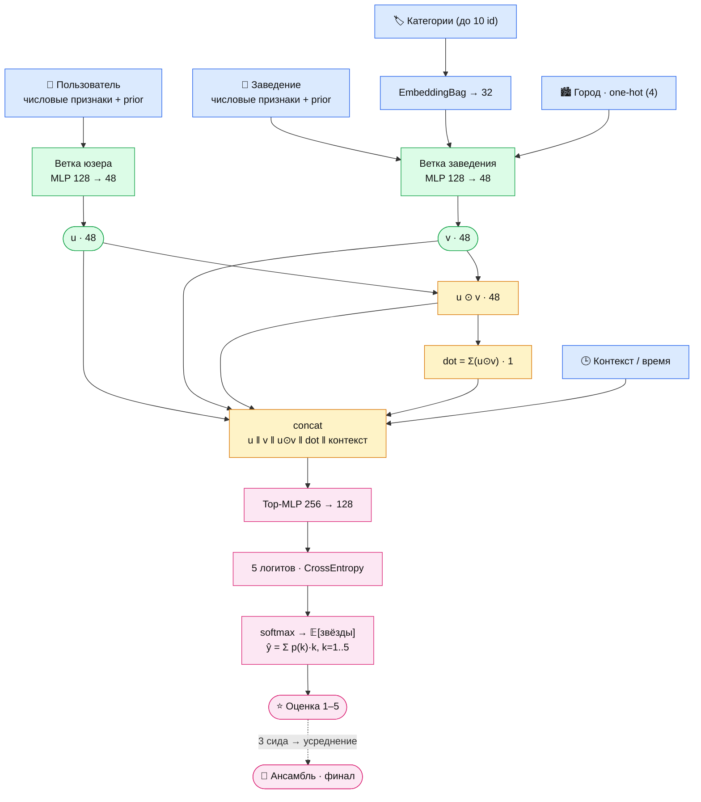

# Yelp DL Project

Этот репозиторий представляет собой учебный проект по **глубинному обучению** на данных платформы **Yelp**.

## О проекте

Yelp - это платформа, где люди делятся отзывами, оценками и короткими заметками о ресторанах,
кафе и услугах. На этих данных мы решаем две задачи, которые складываются в один продуктовый
сценарий.

Первая - **рекомендации**. По табличным данным о пользователях и заведениях полносвязная сеть
предсказывает, на сколько звёзд человек оценит то или иное место, и подбирает подборку
«специально для вас».

Вторая - **анализ отзывов**. Модель читает сам текст: определяет тональность, выделяет
аспекты (еда, сервис, цена) и замечает, когда слова расходятся с оценкой - например, разгромный
отзыв, которому зачем-то поставили пять звёзд.

Связь между задачами - на уровне продукта, а не кода. Обе крутятся вокруг отзывов Yelp: анализ
отзывов следит за их качеством (ловит, где текст расходится с поставленной оценкой), а рекомендатель
по этим оценкам подбирает места «специально для вас». Получается один цикл вокруг отзывов - сначала
проверяем и чистим, потом используем для рекомендаций. Выходы одной модели на вход другой мы не
подаём: задачи решаются отдельно, но завязаны на один продукт и одни данные.

Поверх моделей мы написали тонкий слой инфраструктуры - он делает запуск воспроизводимым и
настраиваемым под разные цели. Срез датасета задаётся в одном месте и подхватывается всеми
ноутбуками, а два флага в `.env` позволяют включать/выключать логирование экспериментов (MLflow) и
генерацию графиков для презентации (папка `artifacts/`).

Сам датасет - [Yelp Open Dataset](https://www.kaggle.com/datasets/yelp-dataset/yelp-dataset),
около 7 млн отзывов по множеству городов. Чтобы данные целиком помещались в оперативную память, а
эксперименты оставались воспроизводимыми, мы работаем со **срезом из нескольких городов**. Сам срез
выбирается не «на глаз», а алгоритмически в `notebooks/01_eda_raw.ipynb`: из городов с достаточным
объёмом отбираются 2–3 со сбалансированными классами оценок и максимумом типсов (заметок без
оценки - сырьё для Задачи 2). По умолчанию это:

> **Tucson, AZ + St Petersburg, FL + Edmonton, AB** - ~665k отзывов, ~209k пользователей,
> ~17.5k заведений, ~92k типсов; классы оценок сбалансированы, города географически разные
> (юг США + Канада).

## Начало работы

### 1. Получение токена Kaggle
Мы не храним исходный датасет у себя в репозитории, так как он весит 9Gb. Для локальной загрузки и отчистки датасета мы написали bootstrap-скрипт, для использования которого необходим Ваш OAuth-токен. Инструкция по получению и правильному размещению токена:
1. Зайдите на [kaggle.com](https://www.kaggle.com) -> аватар -> **Settings** -> раздел **API** ->
   **Create New Token**.
2. Скопируйте шаблон и впишите токен:
   ```bash
   cp .env.example .env
   # затем откройте .env и впишите значение KAGGLE_API_TOKEN=KGAT_...
   ```

В `.env` также есть три флага (по умолчанию `false`), об этих флагах мы уже писали выше:

- `ENABLE_LOGGING` - включает логирование экспериментов с моделями (используется на этапе обучения).
- `ENABLE_ARTIFACTS` - сохранять ли графики EDA в `artifacts/` (при `false` ноутбуки только
  показывают графики, на диск не пишут).
- `ENABLE_FAST_DEV_RUN` - сделать ли быстрый прогон для второй задачи с маленьким сэмплом и одной эпохой для проверки работоспособности пайплайна.

### 2. Bootstrap

```bash
./setup.sh
```

Скрипт создаёт виртуальное окружение `.venv`, ставит зависимости, читает OAuth-токен Kaggle из `.env`,
скачивает датасеты и собирает из них срез по умолчанию (города выше) в parquet.
Срез параметризуется - можно собрать свой набор городов и проверить модели на нём. Примеры:

```bash
./setup.sh --cities "Tampa, FL;Boise, ID"   # свой набор (ключи "City, ST" через ;)
./setup.sh --city "New Orleans" --state LA  # один город
```

> **Windows:** `setup.sh` рассчитан на bash (macOS/Linux). На Windows используйте WSL либо
> выполните настройку окружения вручную:

```bash
python -m venv .venv && source .venv/bin/activate
pip install -r requirements.txt
python scripts/download.py
python scripts/preprocess.py
```

### 3. Ноутбуки

Основная часть проекта находится в папке /notebooks. Папка представляет собой шесть .ipynb файлов, которые можно разбить на три логических блока, со следующим содержанием:

**EDA / подготовка данных**

- **`01_eda_raw.ipynb`** - анализ **сырого** датасета и алгоритмический(жадный) выбор городов-среза (по объёму,
  балансу оценок, числу типсов).
  > **Вывод:** ноутбук помог определиться с итоговым оптимальным срезом для нашей работы **Tucson + St Petersburg + Edmonton** (~665k отзывов, ~92k типсов,
  > norm-entropy оценок 0.87) - сбалансированный по классам и географически разный. Зафиксирован
  > в `_constants.DEFAULT_CITIES` и `reports/selected_cities.json`.

- **`02_eda_slice.ipynb`** - глубокий разведочный анализ уже **нарезанного** среза под обе задачи
  (распределения, разреженность, смещения, длины текста, баланс классов, аспекты, язык).
  > **Вывод:** внимание на Yelp распределено крайне неравномерно (большинство юзеров/мест -
  > с единичными отзывами), значит персонализация требует индивидуальных векторов, а простые смещения
  > «добрый юзер / хорошее место» дают честный baseline. Звезда огрубляет содержание (упоминания
  > *сервиса* тянут оценку вниз сильнее *еды*), а заметная доля отзывов расходится тоном с оценкой -
  > подтверждение необходимости работы с такими типами отзывов.

- **`03_task1_dataset.ipynb`** - сборка **единого плоского датасета** Задачи 1: `reviews` LEFT JOIN `business`
  + `users`, чистка утечек, признаки. Текст и `tips` сюда не входят.
  > **Вывод:** готовы `data/processed/task1_{dataset,embed_inputs,features}.parquet` и словари в директории `artifacts/` на вход для рекомендательной сети (1 строка = пара пользователь×заведение, таргет `stars`).

**Задача 1 - рекомендации (предсказание оценки)**

- **`04_task1_rating_mlp.ipynb`** - полносвязная сеть с явным взаимодействием веток пользователя и
  заведения.
  > **Вывод:** финальный ансамбль - **test RMSE 1.0452** против bias-бейзлайна 1.1210 (**−6.8%**);
  > точное попадание в звезду 52.2%, ошибка ≤1★ - 73.8%. Главный рычаг - time-aware prior-признаки;
  > классиф. голова и явное взаимодействие веток дают доп. прирост. Модель выигрывает на всех
  > сегментах, включая cold-start. Подробности в `reports/task1_model_report.md`.

**Задача 2 - анализ отзывов (текст)**

- В файле **`05_task2_text_models.ipynb`** обучилали модели, которые определяют тональность отзыва (neg/neu/pos) тремя архитектурами по нарастанию ёмкости: TextCNN, BiLSTM, DistilBERT.
  > **Вывод:** macro-F1 растёт с ёмкостью - **TextCNN 0.629 < BiLSTM 0.692 < DistilBERT 0.742**.
  > DistilBERT лучший, особенно на трудном классе *neutral* (3★); цена - на порядок больше параметров
  > и времени обучения.

- **`06_task2_mismatch_detector.ipynb`** в этом файле писали детектор расхождения «текст не соотносится с оценкой» (TextCNN + звезда) на синтетических метках(подпорченный нами датасет); проверяли на абляция stars-only / text-only / text+stars.
  > **Вывод:** stars-only даёт **AUC≈0.50** (по одной звезде лазейки нет - классы выровнены), а
  > **text+stars ≈0.63** заметно выше - модель учит именно *согласованность* текста и оценки. Сигнал
  > идёт в подсказку автору при публикации и в понижение веса «шумных» оценок для рекомендателя.

## Архитектура финальной модели (Задача 1)

Финал — **ансамбль из 3 сидов** сети **InteractionMLP** (вариант «ёмкость+ и классиф. голова»):
две ветки (пользователь / заведение) сводятся в компактные векторы, затем — **явное взаимодействие**
в стиле DLRM (поэлементное произведение `u⊙v` + скаляр `u·v`), а голова — классификация на 5 звёзд
с decode-ожиданием `ŷ = Σ p(k)·k`. Каждый блок MLP — это `Linear → BatchNorm → ReLU → Dropout(0.2)`.



> Почему так: оценки дискретны и бимодальны («1 или 5»), поэтому классиф. голова с матожиданием
> бьёт регрессию одним нейроном; явные `u⊙v` и `u·v` дают модели взаимодействие «вкусов» и свойств
> места без полумиллиона ID-эмбеддингов (контентный подход — важен для cold-start). Подробности —
> `reports/task1_model_report.md`.

## Структура репозитория

```
yelp_project/
├── README.md                   # этот файл
├── .env.example                # шаблон для токена Kaggle (копируется в .env)
├── .env                        # реальный токен (создаётся вручную)
├── .gitignore
├── requirements.txt            # зависимости Python
├── setup.sh                    # bootstrap: venv + скачивание + препроцессинг
├── _constants.py               # общие пути и имена файлов
│
├── scripts/
│   ├── _env.py                 # загрузчик .env
│   ├── download.py             # скачивает Yelp Open Dataset через Kaggle API
│   ├── preprocess.py           # нарезает выбранные города, JSONL преобразует в parquet (потоково)
│   └── build_mismatch_dataset.py  # синтетический датасет для детектора «текст ↔ оценка»
│
├── notebooks/
│   ├── 01_eda_raw.ipynb             # анализ сырого датасета + выбор городов-среза
│   ├── 02_eda_slice.ipynb           # глубокий EDA готового среза
│   ├── 03_task1_dataset.ipynb       # сборка единого датасета Задачи 1 (join таблиц + чистка утечек)
│   ├── 04_task1_rating_mlp.ipynb    # Задача 1: полносвязная сеть, предсказание оценки, сравнение архитектур
│   ├── 05_task2_text_models.ipynb   # Задача 2: TextCNN / BiLSTM / DistilBERT определяет тональность текста
│   └── 06_task2_mismatch_detector.ipynb  # Задача 2: соответствует ли текст оценке
│
├── data/
│   ├── raw/                    # необработанный датасет Yelp
│   ├── processed/              # срез выбранных городов (business/reviews/users/tips)
│   └── mismatch/               # датасет для детектора соответствия текста оценке
│
├── artifacts/                  # генерируемые артефакты: графики, скейлеры, словари (не хранятся в репозитории)
├── logs/                       # веса всех прогонов моделей (метрики/параметры - в mlflow.db)
│   ├── task1/                  #   прогоны Задачи 1 + final/ (ансамбль и одиночная модель)
│   ├── task2_mismatch/
│   └── task2_text/
└── reports/                    # eda_stats.json, selected_cities.json, task1_model_report.md, task1_model_metrics.json
```